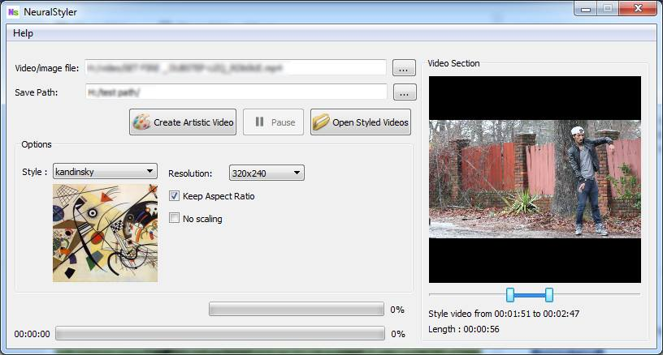
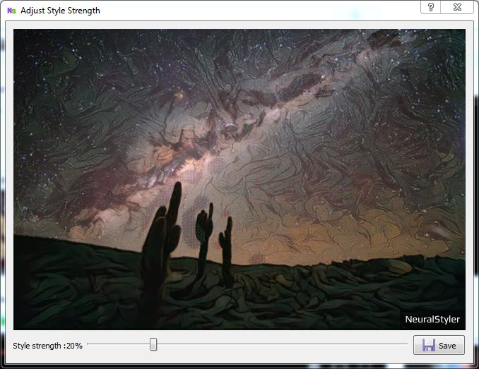

#Basics

Using NeuralStyle You can style video files,photos and Gifs.

Media    | Input format  | Output format 
------------ | ------------- | ------------
Video | All major video formats  | MP4
Photos | All major image formats  | jpeg
Gif| --|gif

#How to Style

Select the video you want to style,select style,resolution etc then press the "Create Artistic Style" button

Wait for some time it will style your video.
Styling speed depends on

* CPU clock speed
* Resolution (lower the resolution faster will be the styling)
* Amount of RAM available(High resolution images/video needs more RAM)

For photos you can adjut style strength after styling 

## How to view styled videos/photos

To open output folder you can use "Open Styled Videos" button

##How to download new style

New styles will be avilable [here](http://neuralstyler.com/styles.html)