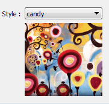
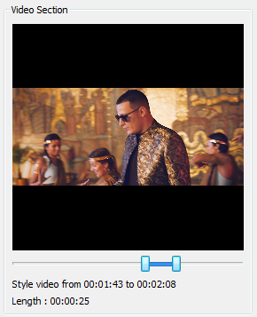

NeuralStyler has following settings

* Styles
* Resolution
* Keep aspect ratio
* No scaling
* Style strenth
* Video selection

## Styles 

You can select wide variety of styles for artistic styling.

Styles uses plugin like system for more details styles help page.

## Resolution

Video/Image output resolution
From version 2.0 it is possible to give custom size

## Keep Aspect Ratio

If this is enabled then output will keep its aspect ratio.

## No scaling

Completly disable scaling.
Beware if your input image/video having high resoltion then it will take longer time to process and the amount of RAM required will be high.

## Style strength

Intensity of styling can be adjusted from 0 to 100%

## Video selection

You can select the section of video for styling

